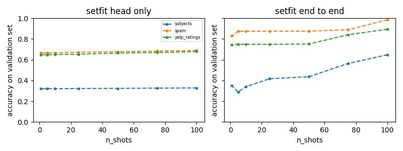

## Overview
Here I explore the few-shot learning performance using variations on the [SetFit](https://arxiv.org/abs/2209.11055) method for text classification modelling. 

## Datasets
Links for datasets used:
- [`yelp_ratings.csv`](https://www.kaggle.com/datasets/matleonard/nlp-course)
- [`spam.csv`](https://www.kaggle.com/datasets/matleonard/nlp-course)
- [`physics_chemistry_biology.csv`](https://www.kaggle.com/datasets/vivmankar/physics-vs-chemistry-vs-biology)

The datasets were pre-processed according to `data_preprocessing.py`

## Repo structure
The root of the repo is separated into 4 folders, which contain the following:
1. `setfit_experiment.py` contains the code for running few-shot learning with SetFit on a range of n_shots, storing the results in mlflow.
2. `flant5.py` contains the code for training the google FLAN-T5 model on the classification task.
3. `utils.py`, `model_training.py`, and `data_loading.py` contain factorized helper functions.

## Results
Results were limited due to lack of compute resources available, but preliminary findings are detailed in this section. End-to-end setfit training, as well as classificatio head-only training, was completed. The results reveal marginally above-chance performance on each of the 3 datasets when training the classification head only, but this is improved when training end-to-end. Training on more examples had a greater effect on the evaluation when doing end-to-end training, particularly on the multi-class dataset. 

## Future directions
- Improve train/test split to reflect `n_shots`
- Standardise train/test dataset sizes across all 3 datasets for comparison
- Investigate cause for reduced performance in multi-label datasets 
- Repair code for FLAN-T5 and body-only setfit training

